<!-- TOC start (generated with https://github.com/derlin/bitdowntoc) -->

- [TBD (To Be Done)](#tbd-to-be-done)
- [RASPI-GBA-SP buy list](#raspi-gba-sp-buy-list)
- [RASPI-GBA-SP guide](#raspi-gba-sp-guide)
   * [First install Retropie](#first-install-retropie)
   * [Screen config ili9341 (2.4, 2.8 or 3.2 inches)](#screen-config-ili9341-24-28-or-32-inches)
   * [Retropie bluetooth config](#retropie-bluetooth-config)
   * [Sound with MAX98357a](#sound-with-max98357a)
   * [Control sound of MAX98357a with potentiometer and PCF8591 ](#control-sound-of-max98357a-with-potentiometer-and-pcf8591)
   * [Adding physical buttons using gpio](#adding-physical-buttons-using-gpio)
   * [Battery](#battery)
   * [Button to safe power on-off](#button-to-safe-power-on-off)
   * [Retropie rom config and backup](#retropie-rom-config-and-backup)
- [Disclaimer](#disclaimer)
- [RASPI-GBA-SP Test video](#raspi-gba-sp-test-video)

<!-- TOC end -->


<!-- TOC --><a name="tbd-to-be-done"></a>
# TBD (To Be Done)

I can't say the project is 100% finished! While this guide will get you to a working product, there are still several important things left to do, such as:

- [ ] Improve the shutdown process. The GPIO Wake-Up works, but a button that shuts down and then cuts off the power would be better.
- [ ] Improve the build. Since this is the first GBA SP I've made, the hinges didn't turn out as expected.
- [ ] Make a PCB so that everything is more organized, although it works with the perfboard.

TBD left 30%  
██████████████░░░░░░

<!-- TOC --><a name="raspi-gba-sp-buy-list"></a>
# RASPI-GBA-SP buy list

This is the list of components used to make a GBA SP that's faithful to the original, with the same size. In the alternative row, I show a second option that may have other features, sizes, or a much higher price.

| Component     | Summary       | Recommended     | Alternative   | Price and image |
| ------------- | ------------- | -------------   | ------------- | -------------   |
| CPU           | It is the brain of our console, it is where we are going to connect the rest of the components. The cheapest and simplest is the Raspberry Pi. But the Radxa is more powerful.  | Raspberry Pi Zero 2 W  | Radxa Zero 3W   | 20 - 30€  |
| Screen        | Although the original screen is 2.9" TFT with 240x160 resolution, we can use a 2.8" 240x320 one since it is very popular and cheap. There are other alternatives with better resolution for a higher price.  | ILI9341 SPI LCD TFT 2.8" 240x320 | LS029B3SX04 2.9" 1440x1440 60 Hz | 8 - 20€ 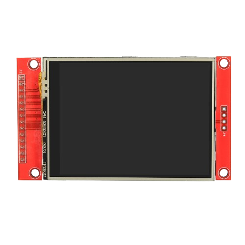 |
| GBA SP shell | Here we have a wide variety of colors and designs to choose from. It would be a good option if it came with buttons and pads so we don't need to buy it later. | Any GBA SP shell |  | 7€  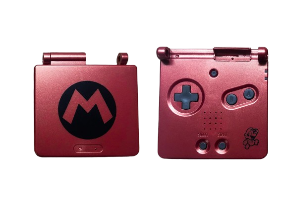 |
| SD card | The Raspberry Pi does not have built-in storage, so we need this to store the operating system. When we buy one, remember check the Speed Class, the write/read speed is important. | Sandisk extreme MicroSD 64gb | | 11€ 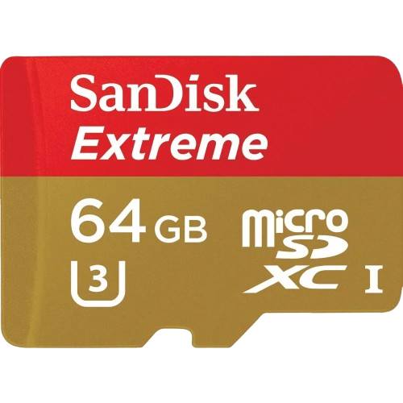 |
| Battery charger | We need a module to power the Raspberry at 5V. There is differents models and usually is done with a TP4056 and a DC-DC step up module. But I like to use a module that have both in the same board and is already regulated to 5V so don't need to check the step up and is more little.  | 5V 3.1A Boost Converter Step-Up Power Module IP5310 | TP4056 + DC-DC step up | 1€ 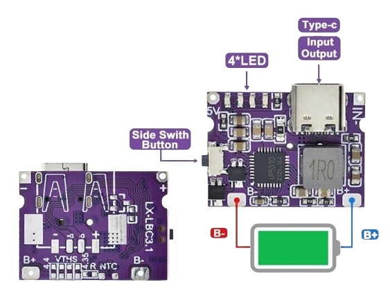 |
| Li po battery | Now we need the battery, we should take a look at the physical size and the capacity is about 1000 mah of consuption per hour. | Li po 3.7V 1000mAh | Li po 3.7V 2000mAh | 5 - 10€ 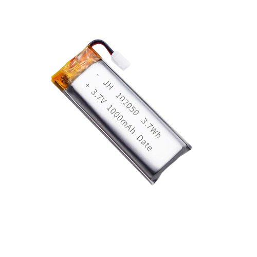 |
| Sound (optional) | The raspberry pi Zero / Radxa comes with bluetooth so speaker sound is optional. | MAX98357A | MH-MX38 or PAM8403 (If want also headset: PCM5102A)| 1 - 3€ 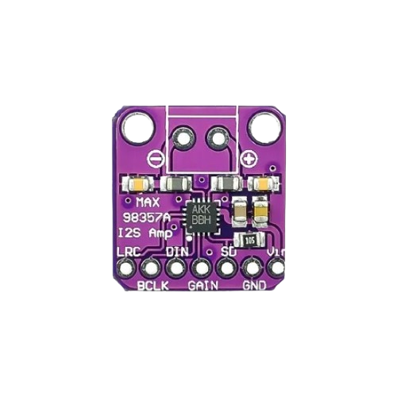 |
| Mini Speaker (optional) | If you buy the sound module, you need a mini speaker, or two if you want stereo sound. Although you can connect 1 speaker outputs to both L/R on the board to trick it and mix it. For the PAM8403 module recommends a 3W 4Ω or 8Ω mini speaker. For more sound power (and more consumption) use the 4Ω, if you want less sound power (less consumption) use the 8Ω | Mini Speaker 8 ohm 3W | Mini Speaker 4 ohm 3W| 2€ 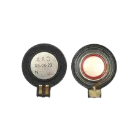|
| Regulate sound (optional) | TBD | | | |


<!-- TOC --><a name="raspi-gba-sp-guide"></a>
# RASPI-GBA-SP guide

<!-- TOC --><a name="first-install-retropie"></a>
## First install Retropie

We are going to download the <a href="https://www.raspberrypi.com/software/">Raspberry pi imager</a>, plug the SD card, select the device and install Retropie.

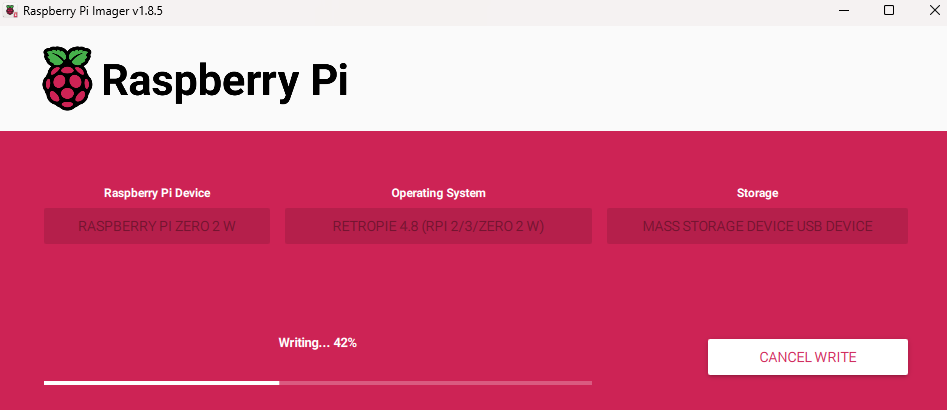


When finish, eject the SD card and put again in the PC. Create in the root of the sd card a empty file called ssh.txt and other file called wpa_supplicant.conf with:

```
### Important: Change country=ES to your country
country=ES
ctrl_interface=DIR=/var/run/wpa_supplicant GROUP=netdev
update_config=1

### Important: Change "YOUR SSDI" with the name of your wifi network and "YOUR PASS"
# RETROPIE CONFIG START
network={
    ssid="YOUR SSDI"
    psk="YOUR PASS"
}
# RETROPIE CONFIG END
```

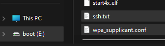

Remember for Raspberry Pi Zero is only 2.4Ghz wifi available. When we connect it, we can use an app like FING, available on Android and iOS to check the IP of our Raspberry.

<!-- TOC --><a name="screen-config-ili9341-24-28-or-32-inches"></a>
## Screen config ili9341 (2.4, 2.8 or 3.2 inches)

Each model of screen is different but most use the same pins. Conect as:

1. Connect the VCC of the TFT to pin 2 (5V)
2. Connect the GND of the TFT to pin 6 (GND)
5. Connect the DC of the TFT to pin 22 (GPIO 25)
3. Connect the CS of the TFT to pin 24 (GPIO 8)
4. Connect the RESET of the TFT to pin 1 (3.3V)
8. Connect the LED of the TFT to pin 7 (GPIO 4)
6. Connect the SDI (MOSI) of the TFT to pin 19 (GPIO 10)
9. Connect SDO (MISO) of the TFT to pin 21 (GPIO 9)
7. Connect the SCK of the TFT to pin 23 (GPIO 11)

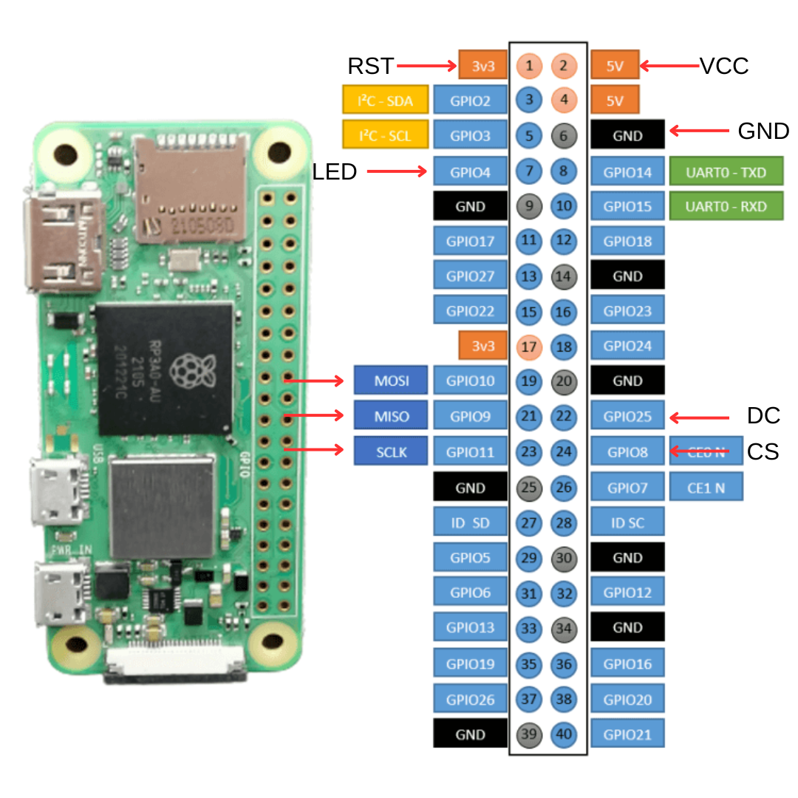

As a SSH client I like to use Bitvise SSH, but we can use Putty or any other. Just put the local IP of the Raspberry, and user by default is pi, password is raspberry, port 22.

We can first update all system. Open the terminal and exec:

```
sudo apt update
```

Next we can exec the script to install the screen, was taken from (https://learn.adafruit.com/running-opengl-based-games-and-emulators-on-adafruit-pitft-displays/pitft-setup) works with not adafruit screens and we can select manual to config:

```
curl https://raw.githubusercontent.com/adafruit/Raspberry-Pi-Installer-Scripts/master/pitft-fbcp.sh >pitft-fbcp.sh && sudo bash pitft-fbcp.sh
```

And we select: 

```
6. Configure options manually        
3. PiTFT / PiTFT Plus 2.8" capacitive       
2. 90° clockwise (portrait)     
1. TFT (MADCTL) rotation 0 
```

In the config of retroarch --> Main settings --> Video --> Scaling --> Aspect ratio --> Full

More info about overlays: https://retrogamecorps.com/2024/09/01/guide-shaders-and-overlays-on-retro-handhelds/

To rotate the screen we edit this file:

```
sudo nano /boot/config.txt
```

And change the ```display_rotate``` to ```0``` by default, ```1``` to rotates by 90 degrees, ```2``` to rotates by 180 degrees, ```3``` to rotates by 270 degrees. 

Can change in ```dtoverlay``` the ```speed``` and ```fps```

And size in ```hdmi_cvt```

To power on the screen, we need to power the GPIO 4 that we connect to LED in the screen. For that we can do it with a simple python script, the code is in this repository code\screen\control_screen.py:

```
sudo nano /usr/local/bin/control_screen.py && sudo chmod +x /usr/local/bin/control_screen.py
```

And exec at the start:

```
sudo nano /etc/rc.local
```

We add in that file before the exit 0: 
```
/usr/bin/python3 /usr/local/bin/control_pantalla.py &
```

<!-- TOC --><a name="retropie-bluetooth-config"></a>
## Retropie bluetooth config

As follow: https://retropie.org.uk/forum/topic/20338/tutorial-bluetooth-audio-on-retropie-v4-4-and-raspberry-pi-3-model-b

```
sudo apt-get install pulseaudio pulseaudio-module-bluetooth pavucontrol paprefs bluez bluez-tools -y && sudo adduser pi bluetooth && \
echo "load-module module-switch-on-connect" | sudo tee -a /etc/pulse/default.pa  && \
echo "load-module module-bluetooth-policy" | sudo tee -a /etc/pulse/default.pa  && \
echo "load-module module-bluez5-device" | sudo tee -a /etc/pulse/default.pa  && \
echo "load-module module-bluez5-discover" | sudo tee -a /etc/pulse/default.pa  && \
echo "load-module module-bluetooth-discover" | sudo tee -a /etc/pulse/default.pa
```

```
sudo sed -i 's|^ExecStart=/usr/lib/bluetooth/bluetoothd|ExecStart=/usr/lib/bluetooth/bluetoothd --noplugin=sap|' /lib/systemd/system/bluetooth.service && \
sudo systemctl daemon-reload && sudo systemctl restart bluetooth
```

```
sudo sed -i 's/^# Privacy = off/Privacy = off/' /etc/bluetooth/main.conf && \ 
sudo sed -i '/^\[General\]/a Enable=Source,Sink,Media,Socket' /etc/bluetooth/main.conf && \
sudo systemctl restart bluetooth
```

```
pulseaudio -k ; pulseaudio --start
```

```
sudo bluetoothctl power on && sudo bluetoothctl scan on &
```

```
sudo bluetoothctl remove MAC ; sudo bluetoothctl pair MAC ; sudo bluetoothctl connect MAC
```

```
amixer sset Master 30%
```

<!-- TOC --><a name="sound-with-max98357a"></a>
## Sound with MAX98357a

Follow: https://learn.adafruit.com/adafruit-max98357-i2s-class-d-mono-amp/raspberry-pi-usage
And: https://antonneld.wordpress.com/2018/04/06/setting-up-pulseaudio/

```
sudo apt install python3-venv wget -y  && \
python3 -m venv env --system-site-packages  && \
source env/bin/activate  && \
pip3 install adafruit-python-shell  && \
wget https://github.com/adafruit/Raspberry-Pi-Installer-Scripts/raw/main/i2samp.py  && \
sudo -E env PATH=$PATH python3 i2samp.py

pactl set-default-sink alsa_output.platform-soc_sound.stereo-fallback
speaker-test -c2 -t wav
nano ~/.config/pulse/default.pa
set-default-sink alsa_output.platform-soc_sound.stereo-fallback
sed -i 's/^audio_volume = .*/audio_volume = -5.0/'  /opt/retropie/configs/gba/retroarch.cfg
```

<!-- TOC --><a name="control-sound-of-max98357a-with-potentiometer-and-pcf8591"></a>
## Control sound of MAX98357a with potentiometer and PCF8591 

Follow: https://docs.sunfounder.com/projects/umsk/en/latest/05_raspberry_pi/pi_lesson10_pcf8591.html

<!-- TOC --><a name="adding-physical-buttons-using-gpio"></a>
## Adding physical buttons using gpio

There are several types of buttons we can use, but the GBA SP uses tactile buttons. We can use these or the typical ones, the way of connect are the same.

The 4 pin buttons are connected diagonally. Even though it has 4 pins we only need to use 2. One pin will be for the GPIO and the other one will go to GND, all GND can be connected together.

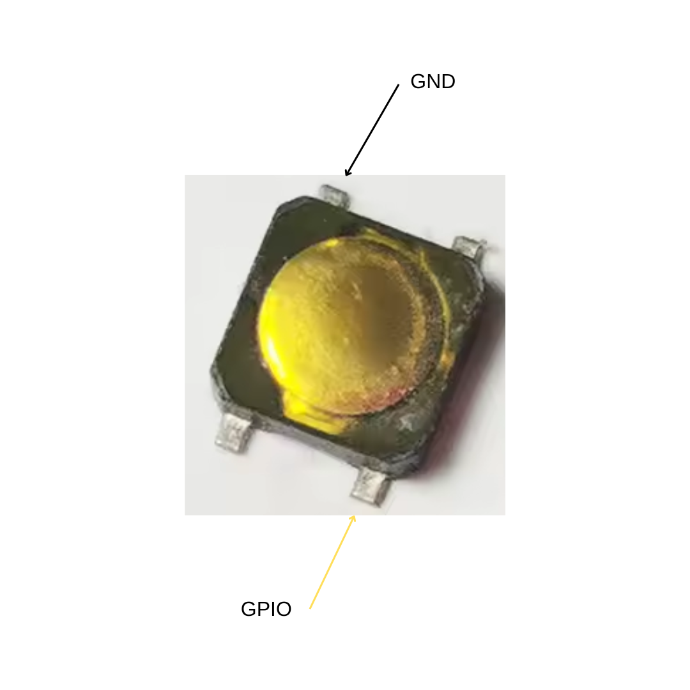

So the GBA SP has 4 buttons for the control pad, 1 for the screen bright, 2 for L/R, 2 for A/B and 2 for start/select which makes a total of 11 buttons = we need 11 GPIO.

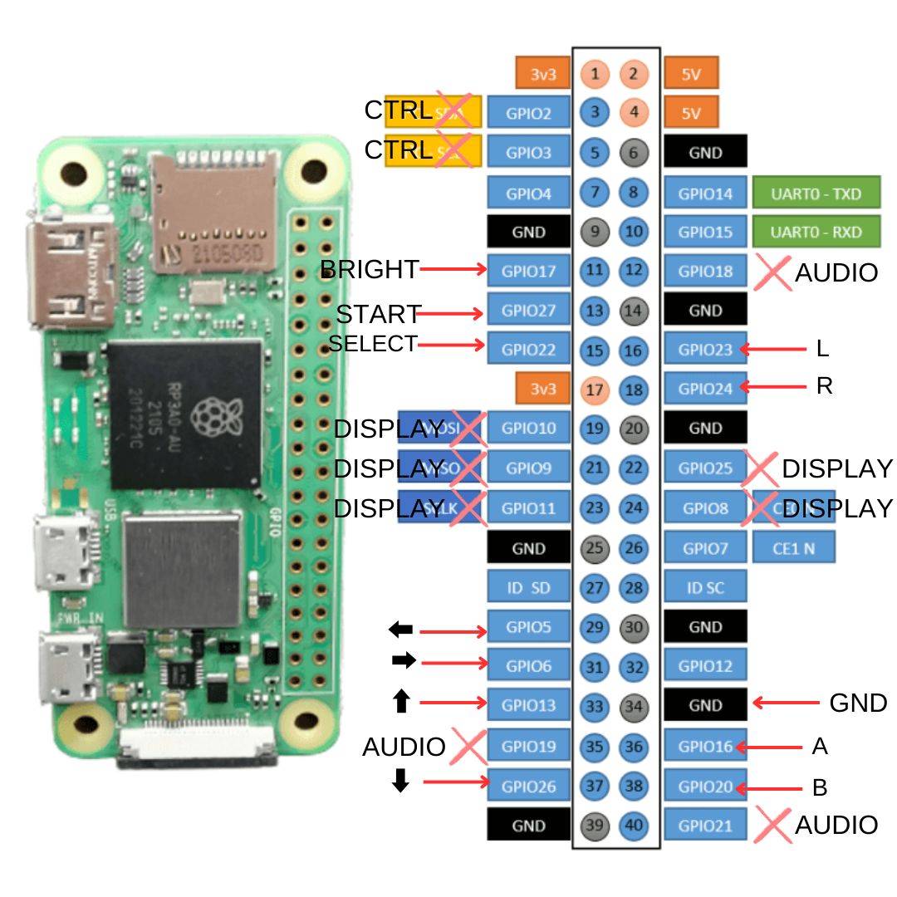

To solder it we can use a Perfboard.

To test the buttons when we have already solder we can use this script in python. Is in this repository, in dir: code/test-button.py

We need to have install:

```
sudo apt install python3-gpiozero
```

And to run we exec:

```
python3 code/button/test-button.py
```

Now to config the Retropie to use the GPIO buttons as follow: https://learn.adafruit.com/retro-gaming-with-raspberry-pi/adding-controls-software

```
curl https://raw.githubusercontent.com/adafruit/Raspberry-Pi-Installer-Scripts/master/retrogame.sh > retrogame.sh && sudo bash retrogame.sh
```

Choose number 1. PiGRRL Zero, later we will add all.

When we reboot, we open the config file:

```
sudo nano /boot/retrogame.cfg
```

To the follow:

```
LEFT       5  # Joypad left
RIGHT      6  # Joypad right
UP        13  # Joypad up
DOWN      26  # Joypad down
LEFTCTRL  16  # 'A' button
LEFTALT   20  # 'B' button
SPACE     22  # 'Select' button
ENTER     27  # 'Start' button
A         23  # Left shoulder button
S         24  # Right shoulder button
ESC    16 20  # Hold A+B to exit ROM
```

<!-- TOC --><a name="battery"></a>
## Battery

For the battery, we're going to use a module that already provides the 5V needed by the Raspberry Pi directly. The IP5310 has worked best for me, and it includes a button to cut off the power supply. This button shouldn't be pressed unless the console is shutdown first.

To connect it we follow the instructions. The battery we connect the black to B- and the red to B+. And on the Raspberry Pi we connect on the back to the 5V pin and to the GND to the module. Remember to buy the module without a USB header otherwise you will have to unsolder it.

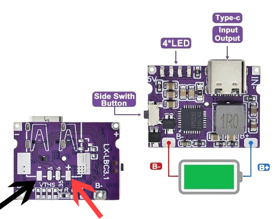 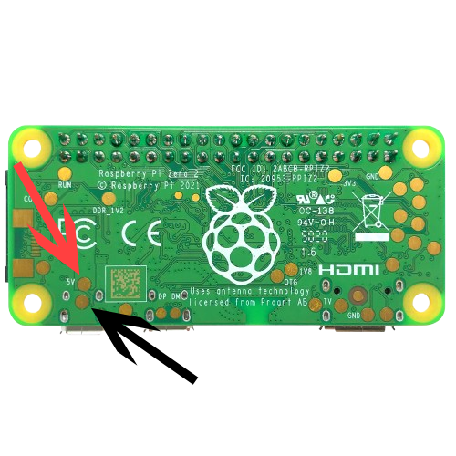

<!-- TOC --><a name="button-to-safe-power-on-off"></a>
## Button to safe power on-off

As follow: https://howchoo.com/pi/how-to-add-a-power-button-to-your-raspberry-pi/

```
git clone https://github.com/Howchoo/pi-power-button.git && ./pi-power-button/script/install
```

<!-- TOC --><a name="retropie-rom-config-and-backup"></a>
## Retropie rom config and backup

To transfer ROMs to Retropie the easy way is in Windows open \\retropie\roms

To backup we install rclone, we can configure many cloud and providers like Dropbox:

```
sudo apt install rclone -y && sudo rclone config
```

We put the sync command in a script to run before we shutdown the Raspberry Pi:

```
sudo nano /usr/local/bin/sync_roms.sh && sudo chmod +x /usr/local/bin/sync_roms.sh
```
```
#!/bin/bash

rclone sync /home/pi/RetroPie/roms dropbox:/roms --log-file=/home/pi/rclone.log
```

And now we create a systemd service for this script:

```
sudo nano /etc/systemd/system/before-shutdown.service
```

```
[Unit]
Description=Run rclone before shutdown
DefaultDependencies=no
Before=shutdown.target network.target


[Service]
Type=oneshot
ExecStart=/usr/local/bin/sync_roms.sh
TimeoutStartSec=0

[Install]
WantedBy=shutdown.target
```

Now enable:

```
sudo systemctl daemon-reload && \
sudo systemctl enable before-shutdown.service && \
sudo systemctl start before-shutdown.service && \
sudo systemctl status before-shutdown.service
```

In Windows we can make a local backup of the roms in case we want have it also:
```
.\rclone.exe sync "dropbox:/RetroPie/roms" "C:/Users/XYZ/example" 
```

<!-- TOC --><a name="disclaimer"></a>
# Disclaimer

It is highly recommended that you use original game files (ROMs) that you own legally. Downloading ROMs from the internet may violate copyright laws and can result in legal issues. Please ensure that you are using ROMs that comply with intellectual property laws and that you have obtained them through legal channels.

<!-- TOC --><a name="raspi-gba-sp-test-video"></a>
# RASPI-GBA-SP Test video

https://github.com/user-attachments/assets/56291d75-d894-40b8-9383-6a546be07b1c
